<div align="center">




[](#)
[](#)
[](#)
[](#)
[](#)
[](#)
[](#)

</div>

<table>
  <tr>
    <td align="center"><strong>25+ years</strong><br />production infrastructure</td>
    <td align="center"><strong>DevOps</strong><br />automation-first delivery</td>
    <td align="center"><strong>Network security</strong><br />BGP, RTBH, threat feeds</td>
    <td align="center"><strong>Practical AI</strong><br />ops, reporting, tooling</td>
  </tr>
</table>

> I help turn complex infrastructure into platforms that are easier to operate, easier to recover, and easier for teams to trust.

## I Build Infrastructure That Keeps Its Promises

I'm Simon, a UK-based Senior Linux, DevOps, and Platform Engineer with 25+ years of experience building, fixing, automating, and improving production systems.

My work sits where infrastructure, automation, networking, storage, security, and pragmatic software engineering meet. I have spent my career keeping real platforms alive: ISP environments, build systems, Docker and Kubernetes estates, virtualisation platforms, storage, DNS, mail, routing, monitoring, backup, and the operational tooling around them.

These days I am especially interested in the layer between operations and software: the Go and Python tools, CI/CD workflows, Ansible roles, Terraform plans, AI-assisted workflows, and small internal services that turn repeated human effort into reliable platform behaviour.

I am also actively exploring practical AI in operations: not hype for its own sake, but useful automation, summarisation, reporting, developer support, and internal tools that help engineers understand systems faster and make better decisions.

<div align="center">



</div>

## What I Bring

| Area | Signal |
| --- | --- |
| **25+ years in production infrastructure** | Linux, networking, ISP operations, virtualisation, storage, mail, DNS, monitoring, support escalation, and mentoring |
| **DevOps and platform engineering** | Ansible, Terraform, Packer, GitHub Actions, GitLab, Jenkins, CI/CD, Docker, Compose, Kubernetes, and automation-first operations |
| **Systems programming for operators** | Go and Python CLIs that are small, inspectable, automation-friendly, and built around real operational workflows |
| **Network and service reliability** | BGP-aware routing, VPNs, HAProxy, Postfix, Dovecot, DNS, observability, backups, and high-availability service design |
| **Modern internal tooling** | Python Flask apps, PowerShell automation, API integrations, web scraping where needed, and AI-assisted reporting workflows |
| **Practical AI adoption** | Applying AI where it improves operational clarity: summarisation, internal reporting, workflow assistance, and human-in-the-loop automation |

## How I Tend To Help

<table>
  <tr>
    <td width="33%" valign="top">
      <strong>Stabilise</strong><br />
      Understand the platform, find the real failure modes, and reduce operational noise.
    </td>
    <td width="33%" valign="top">
      <strong>Automate</strong><br />
      Replace fragile manual steps with code, pipelines, checks, and repeatable workflows.
    </td>
    <td width="33%" valign="top">
      <strong>Modernise</strong><br />
      Move systems forward without losing sight of reliability, recovery, and the people operating them.
    </td>
  </tr>
</table>

## Selected Public Work

A few public examples of the kind of tooling I like to build: practical, operator-facing, and designed to solve specific production problems cleanly.

<table>
  <tr>
    <td width="50%" valign="top">
      <h3><a href="https://github.com/soakes/blackhole-threats">blackhole-threats</a></h3>
      <p>RTBH daemon that turns threat feeds into controlled BGP blackhole announcements for network-security automation and threat-response workflows.</p>
      <p><code>Go</code> <code>BGP</code> <code>GoBGP</code> <code>RTBH</code> <code>threat intelligence</code></p>
    </td>
    <td width="50%" valign="top">
      <h3><a href="https://github.com/soakes/s3ctl">s3ctl</a></h3>
      <p>S3 provisioning CLI for bucket creation, scoped IAM credentials, and batch operations across object-storage estates.</p>
      <p><code>Go</code> <code>S3</code> <code>IAM</code> <code>object storage</code> <code>DevOps</code></p>
    </td>
  </tr>
  <tr>
    <td width="50%" valign="top">
      <h3><a href="https://github.com/soakes/s3mirror">s3mirror</a></h3>
      <p>Production-ready mirror utility for S3-compatible endpoints, with parallel transfers, safe deletion controls, logging, and automation-friendly config.</p>
      <p><code>Python</code> <code>boto3</code> <code>S3</code> <code>CI/CD</code> <code>disaster recovery</code></p>
    </td>
    <td width="50%" valign="top">
      <h3><a href="https://github.com/soakes/telegram-message-exporter">telegram-message-exporter</a></h3>
      <p>Offline recovery and export tool for Telegram on macOS, decrypting local <code>db_sqlite</code> data and exporting to HTML, Markdown, and CSV.</p>
      <p><code>Python</code> <code>SQLite</code> <code>SQLCipher</code> <code>macOS</code> <code>forensics</code></p>
    </td>
  </tr>
  <tr>
    <td width="50%" valign="top">
      <h3><a href="https://github.com/soakes/quotai">quotai</a></h3>
      <p>Small CLI for showing Z.ai quota usage and exact reset windows, packaged like a practical developer/operator utility.</p>
      <p><code>Python</code> <code>CLI</code> <code>monitoring</code> <code>developer tools</code></p>
    </td>
    <td width="50%" valign="top">
      <h3>Built For Operators</h3>
      <p>Small, inspectable tools that work in shells, CI jobs, cron, systemd timers, Ansible workflows, and real incident-response situations.</p>
      <p><code>automation-friendly</code> <code>documented</code> <code>recoverable</code> <code>production-minded</code></p>
    </td>
  </tr>
</table>

## Operating Principles

<table>
  <tr>
    <td width="33%" valign="top">
      <strong>Calm Production</strong><br />
      Designing infrastructure that is boring for users and clear for operators.
    </td>
    <td width="33%" valign="top">
      <strong>Useful Automation</strong><br />
      Replacing manual runbooks with tested automation and readable code.
    </td>
    <td width="33%" valign="top">
      <strong>Operator Tooling</strong><br />
      Building CLIs and services that fit cron, systemd, CI/CD, and Ansible.
    </td>
  </tr>
  <tr>
    <td width="33%" valign="top">
      <strong>Platform Clarity</strong><br />
      Making storage, networking, routing, and services easier to reason about.
    </td>
    <td width="33%" valign="top">
      <strong>Developer Velocity</strong><br />
      Improving build platforms so engineers can ship without fighting machinery.
    </td>
    <td width="33%" valign="top">
      <strong>Team Lift</strong><br />
      Mentoring engineers, documenting well, and raising the operational quality bar.
    </td>
  </tr>
</table>

## Current Focus

- DevOps and platform automation
- Secure self-hosted and hybrid infrastructure
- S3-compatible object storage tooling
- BGP, RTBH, and network-security automation
- Docker, Kubernetes, and build-platform reliability
- Practical AI for operations, internal tools, and reporting workflows

## Engineering Style

```text
Automate the repeatable.
Document the surprising.
Design for recovery.
Keep production calm.
Make the next fix easier than the last one.
```

## Core Toolbox

```text
Linux        Debian, Ubuntu, Red Hat-family systems, macOS, Windows Server
Automation   Ansible, Terraform, Packer, GitHub Actions, GitLab, Jenkins
Runtime      Docker, Docker Compose, Kubernetes, systemd, HAProxy
Code         Go, Python, Bash, PowerShell, Flask, API integrations
Network      DNS, BGP, OSPF, VPNs, VLANs, NAT, routing, firewalls
Services     Postfix, Dovecot, Nginx, Apache, Bind, monitoring, backup
Platforms    Proxmox, VMware, XenServer, Nutanix, KVM, NetApp, Pure, Nimble
```

## GitHub

This profile is a public slice of the work I care about: infrastructure tools, operational notes, experiments, and production-minded utilities from years spent close to the metal.

<div align="center">

[GitHub profile](https://github.com/soakes) |
[Public repositories](https://github.com/soakes?tab=repositories)

</div>

---

<div align="center">

<strong>Useful infrastructure. Clear automation. Calm production.</strong>

</div>
